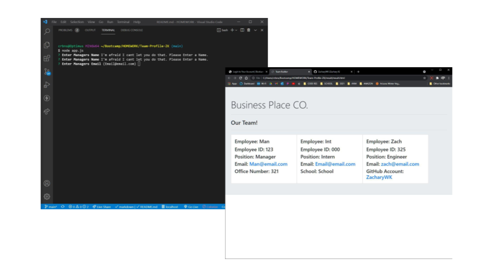

#Team-Profile-ZK 


 ## Table of Contents.
 * [Overview](#overview)
 * [Design](#overview)
 * [Installation](#overview)
 * [Usage](#overview)
 * [Criteria](#given-criteria)
 * [Questions](#have-questions)
 * [Links](#links)
 ---


## Overview 
This is a project was made to generate a webpage that displays a team's basic info.

## Design


The UI was runs through the users terminal and generates a HTML file, default answers are provided as examples of what to enter, additionally many fields have built in validation which do not allow them to be blank.  The HTML only uses CSS from bootstrap 4.0

## Installation Instructions
Install node and the following with npm i, inquirer and jest (for testing)

## Usage Instructions
After installing, use node to launch the app.js, follow the prompts to generate the html. The html file will be located in the result folder when finished.


---
## Given Criteria
WHEN I start the application
THEN I am prompted to enter the team manager’s name, employee ID, email address, and office number

WHEN I enter the team manager’s name, employee ID, email address, and office number
THEN I am presented with a menu with the option to add an engineer or an intern or to finish building my team

WHEN I select the engineer option
THEN I am prompted to enter the engineer’s name, ID, email, and GitHub username, and I am taken back to the menu

WHEN I select the intern option
THEN I am prompted to enter the intern’s name, ID, email, and school, and I am taken back to the menu

WHEN I decide to finish building my team
THEN I exit the application, and the HTML is generated

GIVEN a command-line application that accepts user input

WHEN I am prompted for my team members and their information
THEN an HTML file is generated that displays a nicely formatted team roster based on user input

WHEN I click on an email address in the HTML
THEN my default email program opens and populates the TO field of the email with the address

WHEN I click on the GitHub username
THEN that GitHub profile opens in a new tab


---
## Have Questions
### You can contact me at:

    GITHUB: <https://github.com/ZacharyWK>

    EMAIL: <ZachKrause@live.com>


---
## Links
[REPOSITORY](https://github.com/ZacharyWK/Team-Profile-ZK)
```
https://github.com/ZacharyWK/Team-Profile-ZK
```

[WALKTHROUGH](https://youtu.be/-0J7KVkep5k)
```
https://youtu.be/-0J7KVkep5k
```